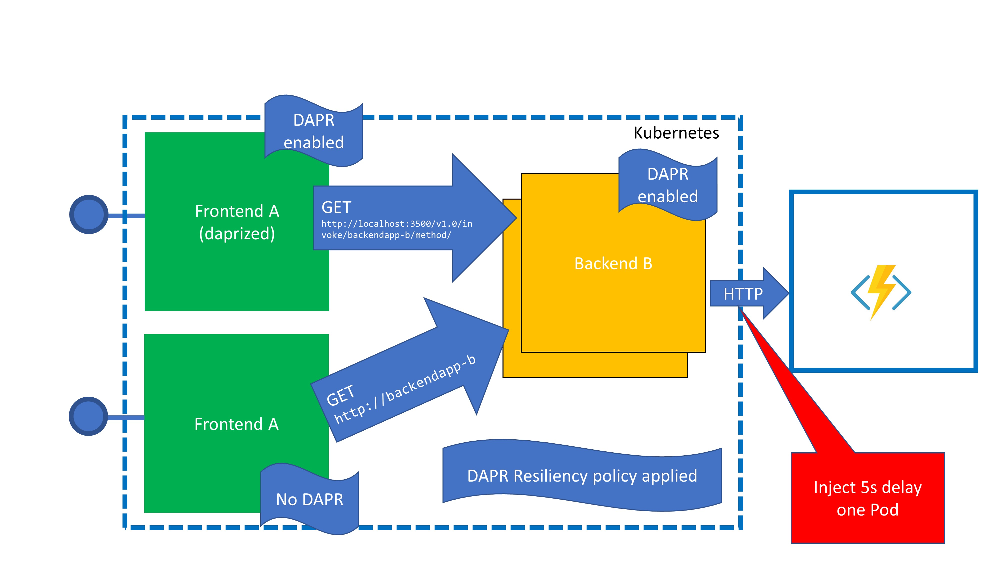

# Azure Chaos Studio :heart: Azure Load Testing :heart: dapr
This repo contains a simple demo app to show how well Azure Chaos Studio, Azure Load Testing and dapr can work together.

The overall story is like this:
- Use Chaos Studio to check how your application behaves if some strange behaviour comes up in your network
- Use Load Testing to make sure you can test the behaviour in a structured manner and you collect the results
- Use dapr to fix issues in your app without touching code.

## Setup & Demo
1. Clone this repo (e.g. into your Azure Cloud Shell)
2. run this
```
cd deployment
setup.sh
```
3. As a result you will get a test.http file created in your deployment folder where some IPs will reflect the public endpoints of your services. Read the description in test.http to understand what they are doing.

4. Run an AKS networking chaos using the chaos/chaos.json configuration. It should have been created already for you in the resource group. If you change the external endpoint also change the external endpoint in this config file.

5. Create an Azure Loadtest targeting your endpoint of frontendapp-A.


## Application Design
The application design is pretty simple. 
Two frontends are sending a request to the backend app. The backend app is reaching out to an external serivce (an Azure funtion).



One of the frontends has dapr enabled, the other is running without dapr per default. The only difference is the deployment yaml file where the dapr configuration is done and where the target urls for both apps are configured.

dapr has resiliency configured to run 5 retries if a request to the backend responds with anything else than an HTTP success status code.
You can see the policy in the resiliency.yaml file.

The backend is configured to return Http status error code 500 if the request to the external http endpoint (an Azure function) is not responding within a configured timeout (500ms). 

Our chaos experiment will introduce a delay by 5000ms when the request goes from backend to the external Azure function. This will result in a timeout of the backendapp. This timeout will result in an error 500 delivered to our frontends.

If the request was triggered by the frontend without dapr enabled, error 500 will be passed on to the client.
If the request was triggered by the frontend with dapr enabled, the retry policy will kick in.


## How to demo
If you want to show off dapr resiliency capabilities just run a load test against the frontend without dapr.
You can use Azure Load Test service or any other service. A simple IP based Quicktest will be good enough, just target the IP of the frontend-A service. 
 Then enable dapr by commenting in the alternate targeturl and the dapr annotations in deployment/deployment_frontednappA.yaml. Then run "kubectl apply -f deployment/deployment_frontednappA.yaml". As soon as the configuration is done the application runs reliably and you can run another loadtest to prove it.

## Tips
You can do yourself a favor and use Rest Client extension in Visual Studio Code. This allows you to simply execute rest calls. Just adjust the IPs in test/test.http


